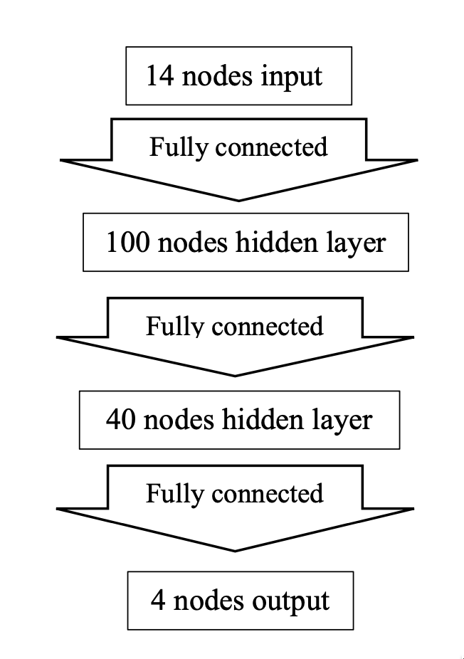

# Neural Networks from Scratch

## Project Description

We are given a data set that contains 14 attributes {𝑥1, 𝑥2, ... , 𝑥14}. Each of these attributes is a binary attribute with a value −1 or 1. The instances in this dataset belong to one of four classes {1,2,3,4}. Construct a neural network, implement the back-propagation algorithm, and use gradient descent to train the network on the provided dataset to predict new instances.

## Architecture

The neural network is a feed-forward neural network with 14 input nodes, 2 hidden layers with 100 nodes and 40 nodes, and 4 output nodes.

It has cross-entropy cost function on a Softmax function for training. All but the last fully connected layers have ReLU as the activation function.
